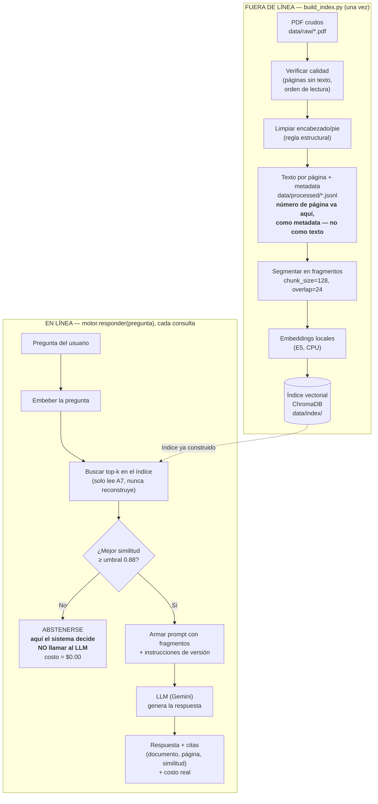
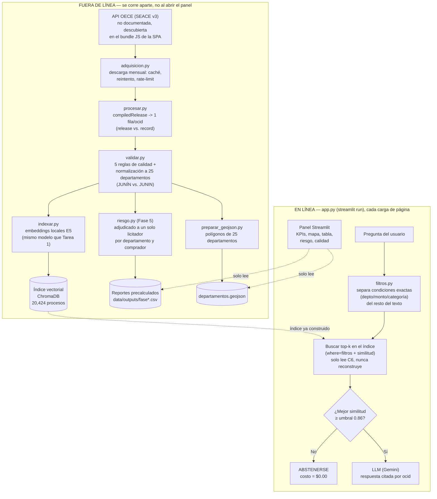

# Diagramas de flujo

Diagramas de referencia para el video de presentación. El mismo diagrama de Tarea 1 vive
también en `tarea1_rag_normativo/README.md`.

## Tarea 1 — RAG normativo

Dos procesos independientes: uno **fuera de línea** (se corre una vez, o
cuando cambian los documentos) y uno **en línea** (se corre en cada
pregunta y nunca vuelve a tocar los PDF).

## Tarea 2 — Radar de contratación pública

Mismo patrón que la Tarea 1: un proceso **fuera de línea** (adquisición ->
validación -> indexado -> indicador de riesgo, cada uno se corre aparte y
una sola vez) y uno **en línea** (el panel Streamlit, que solo LEE lo que
el proceso fuera de línea ya calculó).

