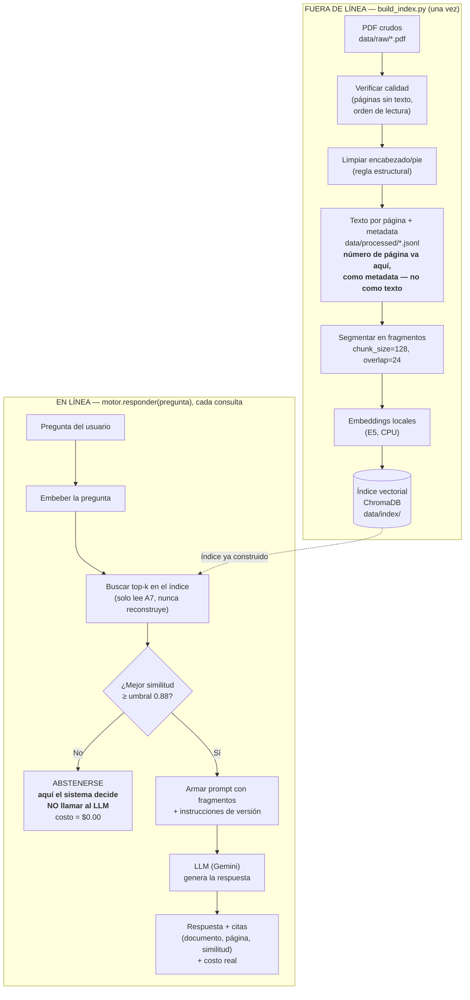

# Tarea 1 — RAG normativo (contratación pública peruana)

Sub-proyecto autocontenido dentro del repo (ver `README.md` en la raíz para
la visión general de ambas tareas). Estado: **Fase 5 completa** —
extracción/limpieza (Fase 1), segmentación/embeddings/índice (Fase 2), motor
con abstención/versiones/costo (Fase 3), evaluación + comparación de
embeddings (Fase 4), e interfaz Streamlit (Fase 5).

## Flujo (fuera de línea vs. en línea)



(Mismo diagrama en `../docs/pipeline.md`, junto con el de la Tarea 2.)

## Estructura

```
config.yaml                # TODA la configuración: rutas, modelo, umbral, prompts, mensajes Y el
                            # registro de documentos fuente (sección `documentos:`) — un solo archivo
build_index.py              # proceso FUERA DE LÍNEA: PDF -> data/processed/ -> índice vectorial
app.py                       # Fase 5: interfaz Streamlit — un solo archivo, solo llama a engine.motor.responder()
.env                          # claves reales (gitignored) — copiar de la raíz del repo: ../.env.example
data/raw/                  # PDF originales, sin modificar, nombrados según config.yaml
data/processed/            # texto limpio por página, en .jsonl, con metadatos y n° de página (Fase 1)
data/index/chroma_storage/ # índice vectorial persistente (se regenera con build_index.py; no va a git)
data/outputs/              # fase1_calidad.*, fase2_*.csv, fase3_*, fase4_evaluacion_local.csv, fase4_comparacion_embeddings.csv
logs/costos.csv            # una fila por cada llamada al LLM, exitosa o fallida (Fase 3)
src/ingest/
  pdf_quality.py           # Fase 1: verificación — páginas sin texto, caracteres/página, orden de lectura
  clean.py                 # Fase 1: limpieza de encabezado/pie (regla documentada, ver docstring)
  pipeline.py               # Fase 1: verifica -> limpia -> escribe data/processed/<doc_id>.jsonl
  informe_fase1.py          # Fase 1: orquesta todos los documentos + arma el reporte de calidad
  embeddings.py             # Fase 2/4: interfaz común de embeddings — local (E5), openai, gemini
  chunking.py               # Fase 2: segmentación por página con conteo de tokens del propio modelo
  vectorstore.py            # Fase 2: índice ChromaDB idempotente y reanudable
  evaluacion.py             # Fase 2: recall@k de una config de chunking contra eval/eval_fase2.yaml
src/engine/
  motor.py                  # Fase 3: responder(pregunta) — único punto de entrada, sin UI
  pricing.py                 # Fase 3: precios Gemini + DeepSeek verificados, fuente y fecha
  costos.py                  # Fase 3: logger de cada llamada a logs/costos.csv
  calibracion.py              # Fase 3: barrido de umbral sobre eval/eval_abstencion.yaml
src/interfaces/
  cli.py                     # Fase 3: interfaz de terminal — solo llama a engine.motor.responder()
eval/
  preguntas.csv               # Fase 4: 26 preguntas (21 dominio + 5 fuera), con página esperada
  eval_fase2.yaml              # 18 preguntas, para comparar configs de chunking (Fase 2)
  eval_abstencion.yaml         # 10 preguntas fuera del corpus verificadas, para calibrar el umbral (Fase 3)
  evaluar.py                  # Fase 4: recall@1/3/5 + tasa de abstención, SIN llamar al LLM
  comparar_embeddings.py      # Fase 4: construye 2 índices idénticos (local vs. API) y los compara
  comparar_bm25.py            # Innovación (bono): BM25 vs. embeddings en preguntas coloquiales
```

## Cómo obtener los 2 PDF obligatorios

Los sitios oficiales bloquean la descarga automática (gob.pe responde HTTP 418 a bots;
los botones de El Peruano se generan con JavaScript), así que se bajan **a mano**:

1. Ley N.° 32069 — abrir en el navegador:
   https://www.gob.pe/institucion/osce/colecciones/45029-ley-n-32069-ley-general-de-contrataciones-publicas
   y descargar el PDF de la ley. Guardarlo como `data/raw/ley_32069.pdf`.
2. Decreto Supremo N.° 001-2026-EF — abrir:
   https://busquedas.elperuano.pe/dispositivo/NL/2474920-3
   y usar el botón "PDF" de la página. Guardarlo como `data/raw/ds_001_2026_ef.pdf`.
3. Completar la `fecha_descarga` (YYYY-MM-DD) de cada documento en la sección
   `documentos:` de `config.yaml`.

## Instalación y ejecución completa, desde cero (Windows, PowerShell)

Pasos exactos, probados en esta máquina (Windows 11):

```powershell
# 0. Parado en tarea1_rag_normativo/
cd tarea1_rag_normativo

# 1. Entorno virtual (Python 3.12)
uv venv --python 3.12 .venv
# — o, sin uv: py -3.12 -m venv .venv

# 2. Dependencias (requirements.txt está en la RAÍZ del repo)
uv pip install --python .venv\Scripts\python.exe -r ..\requirements.txt
# — o, sin uv: .venv\Scripts\python.exe -m pip install -r ..\requirements.txt

# 3. Colocar los 2 PDF en data/raw/ (ver sección de arriba)

# 4. API key: copiar el ejemplo de la raíz del repo y completar
copy ..\.env.example .env
# editar .env y pegar GEMINI_API_KEY=... (o DEEPSEEK_API_KEY si se cambia el proveedor en config.yaml)

# 5. Construir el índice — proceso FUERA DE LÍNEA, se corre una sola vez
#    (o cuando cambian los documentos fuente)
.venv\Scripts\python.exe build_index.py

# 6. Correr la app
.venv\Scripts\streamlit.exe run app.py
```

Se abre en `http://localhost:8501`. Si falta algún PDF en `data/raw/`,
`build_index.py` lo marca como `"PDF no encontrado"` en la tabla de calidad
en vez de fallar para los demás documentos.

**Nota de rendimiento:** la primera vez que se importa `sentence-transformers`
en un entorno virtual recién creado, la importación puede tardar 1–2 minutos
(carga en frío de PyTorch/transformers, no descarga de red — confirmado con
`HF_HUB_OFFLINE=1` activo, seguía tardando igual). Las corridas siguientes
son rápidas (segundos). No es un error ni un cuelgue, es solo la primera vez.

## Dependencias instaladas

Fase 1: `pypdf`, `pdfplumber`, `pandas`, `pyyaml`, `tabulate`, `requests`, `python-dotenv`.
Fase 2: `sentence-transformers`, `chromadb`, `langchain-text-splitters`, `numpy<2`
(chromadb arrastra `numpy<2`; ver `requirements.txt`).
Fase 3: `matplotlib` (gráfico de calibración), `google-genai` (SDK de Gemini,
proveedor activo por defecto). Si se cambia `generacion.proveedor` a `deepseek`
en `config.yaml`, no hace falta SDK adicional — el motor lo llama con `requests`.

**Importante:** si instalas paquetes nuevos con `uv pip install`, revisa que no
te suba `numpy` a la versión 2 (chromadb/onnxruntime necesitan `numpy<2`). Si
pasa, corre: `uv pip install --python .venv\Scripts\python.exe "numpy<2"`.

## Regla de limpieza de Fase 1 (resumen — detalle en `src/ingest/clean.py`)

Cualquier línea cuya versión sin dígitos y sin espacios aparece en ≥70% de las
páginas del documento, y mide menos de 90 caracteres, se trata como
encabezado/pie repetido y se elimina. Se ignoran también los espacios porque
El Peruano maqueta en formato periódico: el mismo encabezado sale con
espaciado distinto en páginas pares e impares (comprobado en el PDF real).
El contenido legal (artículos, incisos, listas con letras) nunca se repite
letra por letra entre páginas, así que nunca cae en ese umbral. Validado
tanto con un PDF sintético como con los 2 documentos reales: el encabezado
desaparece y los artículos/listas sobreviven intactos.

## Fase 2 — decisiones y evidencia

**Modelo de embeddings:** `intfloat/multilingual-e5-small` (local, CPU, 384 dim).
Verificado contra el propio modelo/model card (no memoria): `max_seq_length = 512`
tokens, y el README oficial exige anteponer `"query: "` a las preguntas y
`"passage: "` a los fragmentos indexados (`src/ingest/embeddings.py`).

**Chunk size/overlap — elegido con evidencia, no por defecto:** se compararon 2
configuraciones contra `eval/eval_fase2.yaml` (18 preguntas con página esperada),
midiendo `recall@5`:

| chunk_size | overlap | recall@5 | fragmentos | tokens (mediana) |
|---|---|---|---|---|
| 128 | 24 | **0.944** (17/18) | 751 | 114 |
| 256 | 48 | 0.833 (15/18) | 354 | 237 |

Gana 128/24: fragmentos más chicos citan la página exacta con más precisión en
este corpus (artículos legales cortos). Ambas configs quedan muy por debajo del
límite de 512 tokens del modelo.

**IDs de fragmento:** `"{doc_id}::p{pagina:04d}::c{índice_en_pagina:03d}"` —
únicos entre documentos (prefijo `doc_id`) y estables entre corridas (misma
entrada + misma config -> mismos fragmentos, mismo orden).

**Índice idempotente y reanudable:** `src/ingest/vectorstore.py` consulta qué
`chunk_id` ya existen antes de embeber/agregar cada lote. El notebook 02
demuestra, con los documentos reales:
- correr la indexación dos veces no duplica nada (`agregados_ahora == 0` la 2ª vez),
- "interrumpir" a la mitad y volver a correr con la lista completa termina
  exactamente lo que faltaba, sin recalcular lo ya guardado,
- agregar `ds_001_2026_ef` no modifica ni un solo id de `ley_32069`.

**Fragmentos por documento (config ganadora):** `ley_32069` = 515, `ds_001_2026_ef` = 236
(total 751). Distribución de longitud completa en `data/outputs/fase2_distribucion_longitud.csv`.

## Fase 3 — motor RAG: umbral, versiones y alcance

**`src/engine/motor.py`** expone `responder(pregunta) -> dict` como único punto
de entrada. No importa Streamlit ni ninguna librería de UI — verificado con:
`Select-String -Path src\engine\motor.py -Pattern "^\s*(import|from)\s+(streamlit|tkinter|flask)"`
(sin resultados; una búsqueda ingenua sin anclar a `import`/`from` sí "encuentra"
la palabra porque este mismo docstring la menciona al explicar la regla).

**Decide antes de llamar al LLM.** Si la similitud del mejor fragmento
recuperado (top-1) es menor que `umbral_similitud` (en `config.yaml`), el motor
se abstiene y devuelve un mensaje fijo sin gastar ni un token de generación
(`costo_usd = 0.0` garantizado).

**Umbral calibrado con evidencia, no por intuición** (`eval/eval_abstencion.yaml`,
18 preguntas dentro del corpus + 10 fuera, verificadas por búsqueda exacta de
texto antes de escribirlas). El barrido (`data/outputs/fase3_barrido_umbral.csv`,
gráfico en `data/outputs/fase3_calibracion_umbral.png`) muestra que las similitudes
NO son intuitivas: preguntas totalmente ajenas al dominio ("capital de
Francia" = 0.76) y preguntas del dominio pero fuera del corpus ("adjudicación
simplificada" = 0.85, "penalidad por mora" = 0.88) se mezclan en el mismo
rango que preguntas legítimas (0.84–0.92). Ningún umbral separa perfectamente
ambos grupos.

*Disyuntiva responder-mal vs. no-responder:* una abstención de más solo le
cuesta al usuario reformular la pregunta; una respuesta segura pero
incorrecta en este dominio (una PYME decidiendo si presentarse a una
licitación) puede costarle dinero real. Se eligió `umbral_similitud = 0.88`:
el umbral más bajo que logra 0% de falsos-respuesta en el conjunto de
evaluación, aceptando a cambio ~50% de falsos-abstención sobre las preguntas
que sí tenían respuesta — conservador a propósito.

**Gestión de versiones.** El corpus tiene la Ley N.° 32069 y el DS N.°
001-2026-EF, que en realidad modifica el *Reglamento* de esa ley (un tercer
documento, no indexado) — no la ley directamente. Cada instrumento numera sus
artículos desde 1 de forma independiente, lo que produce colisiones reales:
**"Artículo 42"** es *Estandarización de requerimientos* en la Ley (página 22)
pero *Segmentación de contrataciones* en el Reglamento modificado (página 2
del DS). Estrategia: cada fragmento lleva `doc_id`, `titulo`, `tipo` y
`version` en su metadata, y el `system_prompt` (`config.yaml`, regla 3)
prohíbe explícitamente combinar "Artículo N" entre documentos distintos.
Demostrado en el notebook 03: la pregunta "¿Qué dice el artículo 42?" recupera
fragmentos de AMBOS documentos, cada uno con su `doc_id`/`version`/`pagina`
intactos y nunca mezclados.

**Límites del corpus.** El Reglamento completo no está indexado. Preguntas
como "¿Qué requisitos tiene una Adjudicación Simplificada?" (término ausente,
verificado) devuelven `abstuvo=True` y un mensaje explícito recomendando
consultar el Reglamento o a un especialista — nunca una respuesta improvisada
con el fragmento más cercano.

**Abstención como campo estructurado.** El resultado de `responder()` siempre
trae `abstuvo: bool`, calculado ANTES de llamar al LLM — ninguna interfaz
necesita inferirlo comparando el texto de la respuesta.

**Errores de API nunca como respuesta normal.** Probado con fallas reales del
proveedor (no simuladas): API key inválida (Gemini 400, DeepSeek 401), sin
saldo (DeepSeek 402), modelo dado de baja (Gemini 404), sobrecarga transitoria
(Gemini 503). En todos los casos `responder()` lanza `ErrorDeAPI` — una
excepción, nunca un diccionario disfrazado de éxito. Cada intento (exitoso o
no) queda registrado en `logs/costos.csv`, incluido el motivo del fallo.

**Proveedor de generación — dos opciones, intercambiables por config:**

| | Gemini (activo por defecto) | DeepSeek (alterno) |
|---|---|---|
| Modelo | `gemini-3.6-flash` | `deepseek-flash` |
| Costo real para esta demo | **$0.00** (capa gratuita) | ~$0.0003 por pregunta (prepago) |
| Precio varía por hora | **No** — verificado: "Pricing is flat" en la página oficial | **Sí** — horas "peak" (01:00-04:00 y 06:00-10:00 UTC, lun-vie) cuestan el doble que "off-peak" |
| Fuente de precios | `ai.google.dev/gemini-api/docs/pricing` (verificado 2026-09-20) | `api-docs.deepseek.com/quick_start/pricing` (verificado 2026-09-20, corroborado por búsqueda independiente) |

Se documentan ambos a propósito: el enunciado pide investigar si el proveedor
varía precio por hora — para Gemini la respuesta verificada es que no, para
DeepSeek sí, y `src/engine/pricing.py` calcula el costo correcto según cuál
esté activo. Cambiar de proveedor es editar `generacion.proveedor` en
`config.yaml`, no tocar código (ver `motor.py::_calcular_costo`).

Nota real de la demo: la API de Gemini rechazó en vivo `gemini-2.5-flash`
("no longer available to new users") y recomendó `gemini-3.6-flash` — los
nombres de modelo cambian más rápido que la documentación, así que el nombre
correcto se confirma contra la propia API, no contra lo que diga una fuente
externa desactualizada.

## Cómo correr una pregunta desde la terminal

```powershell
cd tarea1_rag_normativo
.\.venv\Scripts\python.exe src\interfaces\cli.py "¿Se necesita una adenda para aprobar una prestación adicional de obra bajo el sistema solo construcción?"
```

Necesita `GEMINI_API_KEY` (o `DEEPSEEK_API_KEY` si se cambió el proveedor) en
`tarea1_rag_normativo/.env` (ver instalación arriba). Sin argumentos,
`src\interfaces\cli.py` pide la pregunta de forma interactiva.

La capa gratuita de Gemini devuelve de vez en cuando `503 UNAVAILABLE` ("high
demand") de forma transitoria — visto varias veces en pruebas reales. No es un
bug: `responder()` lo propaga como `ErrorDeAPI` correctamente; basta con
volver a correr el mismo comando.

## Fase 4 — evaluación y comparación de implementaciones

### Conjunto de evaluación (`eval/preguntas.csv`)

26 preguntas: **21 de dominio** (cada una con `doc_id_esperado` y
`paginas_esperadas`, verificadas por búsqueda exacta en el corpus antes de
escribirlas) + **5 fuera de dominio**. Desglose:

- 11 preguntas en estilo legal, sobre la Ley (sin relación con la norma modificatoria).
- **7 preguntas ligadas a artículos afectados por el DS N.° 001-2026-EF**
  (la norma modificatoria) — más del triple del mínimo de 3 pedido.
- **5 preguntas en estilo coloquial**, como las haría el dueño de una PYME
  (ej. *"Si gano una obra del Estado, ¿me dan plata por adelantado para
  poder comprar materiales?"*), no como está redactada la ley.
- 5 fuera de dominio: 2 "cercanas" (términos reales de contratación pública
  que no aparecen en el corpus, ej. "adjudicación simplificada" — solo el
  Reglamento completo las cubre) + 3 "lejanas" (ceviche, Copa Mundial, capital
  de Francia).

### `eval/evaluar.py` — recall@k y abstención, sin llamar al LLM

Mide dos etapas distintas del pipeline por separado:

1. **Recall@1 / @3 / @5** — etapa de **recuperación** (embedder + índice):
   ¿el fragmento correcto aparece entre los k primeros resultados de
   `coleccion.query()`? No depende de qué tan bien redactaría el LLM la
   respuesta final.
2. **Tasa de abstención (correcta/incorrecta)** — etapa de **decisión** (el
   umbral de similitud): ¿el motor decidiría bien si debe intentar
   responder, usando solo la similitud del mejor fragmento? Esto ocurre
   después de recuperar pero antes de llamar al LLM.

**Por qué la evaluación no tiene costo:** el modelo de embeddings, el
chunking y el umbral son los parámetros que más se ajustan durante el
desarrollo — se corren decenas de veces por sesión de trabajo. Si cada
corrida llamara al LLM, iterar sería lento y costoso. Separar "¿la
recuperación trae lo correcto?" (gratis, determinístico) de "¿la respuesta
generada es buena?" (paga, no determinístico) permite optimizar la parte
barata exhaustivamente y gastar presupuesto de generación solo al validar
la configuración ya elegida.

**Resultado real** (índice local de producción, umbral 0.88 de Fase 3):

| Métrica | Valor |
|---|---|
| Recall@1 | 0.571 |
| Recall@3 | 0.762 |
| Recall@5 | 0.905 (19/21) |
| Abstenciones correctas (fuera de dominio) | 5/5 (100%) |
| Abstenciones incorrectas (dominio) | 12/21 (57.1%) |

Hallazgo honesto: el umbral 0.88, calibrado en Fase 3 sobre un conjunto más
chico y más "legal" en estilo, generaliza peor a este conjunto más grande y
con preguntas coloquiales (57.1% de falsos-negativos vs. 50% en Fase 3).
Sigue sin fallar del lado peligroso (0% de falsos-positivos), pero es
evidencia de que un umbral fijo necesita recalibrarse con datos
representativos del uso real — quedó fuera del alcance de esta fase, pero
documentado como hallazgo, no escondido.

### Comparación obligatoria de embeddings

**Interfaz común, tres implementaciones intercambiables por config**
(`src/ingest/embeddings.py::crear_embedder(proveedor, modo)`): `local` (E5),
`openai` (`text-embedding-3-small`) y `gemini` (`gemini-embedding-2`). Las
tres exponen la misma interfaz de ChromaDB (`EmbeddingFunction`), así que
`vectorstore.py`, `motor.py` y `eval/evaluar.py` nunca saben cuál está activa
— `motor.py` la resuelve leyendo `embeddings.proveedor` de `config.yaml`
(bug real que encontré y corregí: antes tenía `E5Embedder` hardcodeado ahí,
así que ese campo no hacía nada; ahora sí lo respeta, verificado con una
pregunta real después del arreglo).

**Advertencia real de esta interfaz:** cambiar `embeddings.proveedor` en
`config.yaml` *solo* tiene efecto si `rutas.indice_vectorial` también apunta
a un índice construido con ESE MISMO proveedor. Los vectores de un índice no
son intercambiables entre modelos — distinta dimensión (384 vs. 3072) y
distinta escala de similitud coseno (ver el hallazgo del umbral, abajo). No
es un cambio de una sola línea; el índice también hay que reconstruirlo con
el nuevo embedder (`eval/comparar_embeddings.py` hace exactamente eso).

**Desviación del enunciado, documentada:** se pide comparar contra
`text-embedding-3-small` de OpenAI. La cuenta de OpenAI disponible no tenía
saldo prepago — a diferencia de Gemini, **OpenAI no tiene ninguna capa
gratuita para su API**, ni de prueba, así que no había forma de correr esa
comparación sin un pago real. El código de `OpenAIEmbedder` está completo y
listo (`eval/comparar_embeddings.py --api-proveedor openai` una vez haya
saldo); la corrida real que se reporta abajo usa Gemini (`gemini-embedding-2`,
capa gratuita real, $0.00 verificado) para tener números medidos y no
inventados. Precio de OpenAI verificado igual, por completitud: $0.02 USD
por 1M tokens (`developers.openai.com/api/docs/models/text-embedding-3-small`,
2026-09-20) — indexar los 751 fragmentos de este corpus completo habría
costado, al precio real, **~$0.0016 USD** (menos de un quinto de centavo).

**Resultado real** (mismos 751 fragmentos en ambos índices, construidos desde
cero y cronometrados; `data/outputs/fase4_comparacion_embeddings.csv`):

| Métrica | Local (`multilingual-e5-small`) | API (`gemini-embedding-2`, capa gratuita) |
|---|---|---|
| Tiempo de indexación | **28.6 s** | 838 s (~14 min) |
| Dimensión del vector | 384 | 3072 |
| Costo de indexación | $0.00 | $0.00 (capa gratuita; $0.20/1M en tarifa pagada) |
| Recall@1 | 0.571 | **0.667** |
| Recall@3 | 0.762 | **0.857** |
| Recall@5 | 0.905 | 0.905 (empate) |
| Latencia promedio por consulta | **21.0 ms** | 745.8 ms |

**Hallazgo adicional, no pedido por el enunciado pero relevante:** al
reutilizar el umbral 0.88 (calibrado para E5) con los embeddings de Gemini,
el motor se abstuvo en **21 de 21 preguntas de dominio (100%)** — la escala
de similitud coseno de un modelo no es comparable con la de otro. **El
umbral de abstención no es portable entre modelos de embeddings**; cambiar
de proveedor sin recalibrar puede convertir un asistente funcional en uno
que nunca responde nada, silenciosamente.

### ¿Cuál elegiría para este caso, y por qué?

**El local (`multilingual-e5-small`).** El precio por sí solo no decide nada
aquí — ambos salieron gratis en esta corrida, y aunque se pagara la tarifa
real de OpenAI, indexar todo este corpus cuesta menos de un quinto de
centavo. Lo que sí decide:

1. **Recall@5 empata** (0.905 en ambos) — y `k=5` es el valor real que usa
   el motor en producción (`config.yaml`). La ventaja de la API en
   recall@1/@3 es real pero no cambia lo que el motor termina viendo.
2. **Latencia: 35× más rápido.** 21 ms vs. 746 ms por consulta importa
   mucho en un asistente interactivo — es la diferencia entre sentirse
   instantáneo y sentirse lento en cada pregunta.
3. **Sin límite de cuota externo.** La capa gratuita de Gemini limita a 100
   peticiones/minuto — nos topamos con ese límite en vivo indexando el
   corpus. Un servicio en producción no debería depender de una cuota que
   puede agotarse o cambiar sin aviso.
4. **Funciona sin internet una vez indexado** — coherente con el requisito
   original del curso de que todo corra en una laptop común, solo CPU.
5. **Vector 8× más chico** (384 vs. 3072) — más barato de almacenar y de
   operar a medida que el corpus crezca (Tarea 2 va a sumar muchos más
   documentos).

La API ganaría si el diseño usara `k=1` (ahí sí hay una diferencia real de
9.6 puntos de recall) o si el corpus fuera tan grande que la calidad
semántica importara más que la latencia — no es el caso aquí.

## Innovación (bono) — BM25 vs. búsqueda semántica en preguntas coloquiales

`eval/comparar_bm25.py`. Motivación: la hipótesis habitual es que los
embeddings ganan en preguntas coloquiales porque entienden paráfrasis
("plata por adelantado" ≈ "adelanto directo al contratista"), mientras que
BM25 (léxico puro — cuenta términos compartidos, ponderados por frecuencia
inversa de documento) debería fallar cuando la pregunta no comparte
vocabulario con el texto legal. Esto se midió con evidencia real, no se
asumió: se tomaron los MISMOS 751 fragmentos ya indexados por
`build_index.py` (se leen del índice ChromaDB existente, sin reconstruir
nada) y se compararon ambos métodos sobre las 5 preguntas marcadas
`estilo=coloquial` en `eval/preguntas.csv` (ids 17-21).

**Resultado real** (`data/outputs/fase4_bm25_vs_semantica.csv`):

| Métrica | BM25 (léxico) | Semántica (embeddings, E5) |
|---|---|---|
| Recall@1 | 0.2 (1/5) | 0.2 (1/5) |
| Recall@3 | **0.6 (3/5)** | 0.4 (2/5) |
| Recall@5 | 0.6 (3/5) | 0.6 (3/5) |

**Hallazgo honesto, contrario a la hipótesis inicial:** en este conjunto
(muy chico, 5 preguntas) BM25 empata o incluso *gana* en recall@3, no
pierde. Ejemplo concreto — pregunta 17 ("¿me dan plata por adelantado para
poder comprar materiales?", página esperada 7 de `ds_001_2026_ef`): BM25
acierta en el top-1 (score 11.82) porque "adelantado" aparece literalmente
en el fragmento correcto, mientras que la similitud semántica (0.8605) trae
primero fragmentos temáticamente cercanos pero de otra página, y solo
alcanza a la página correcta en el top-5. Dicho de otro modo: cuando la
paráfrasis coloquial conserva al menos una palabra clave del texto legal
(caso frecuente en este corpus — "adelanto"/"adelantado", "registro"), BM25
no tiene la desventaja que se esperaba.

**Limitaciones de esta comparación (documentadas, no escondidas):**
- Solo 5 preguntas — es evidencia puntual sobre este corpus, no una
  conclusión generalizable ni estadísticamente robusta.
- Tokenización simple para BM25 (minúsculas + separación alfanumérica, sin
  stopwords ni stemming en español); una tokenización más cuidada podría
  mover el resultado en cualquier dirección.
- El score de BM25 (TF-IDF probabilístico) no está en la misma escala que
  la similitud coseno — aquí solo se usa para *rankear* candidatos dentro de
  cada método, nunca para comparar un score de BM25 contra un umbral de
  similitud calibrado para embeddings (ni viceversa).
- No reemplaza al motor de producción: el sistema sigue usando embeddings
  (con umbral calibrado en Fase 3) porque generaliza mejor sobre el
  conjunto completo de 21 preguntas de dominio (recall@5 = 0.905, ver
  arriba), no solo sobre las 5 coloquiales.

## Fase 5 — interfaz Streamlit (despliegue local)

`app.py`, un solo archivo. Mismo principio que `src/interfaces/cli.py`: no tiene
ninguna lógica de RAG propia, solo llama a `engine.motor.responder()` y
muestra el resultado tal cual — nunca infiere nada del texto de la respuesta.

### Instalación y ejecución

Ya cubierto arriba en "Instalación y ejecución completa, desde cero" —
pasos 1-4 preparan todo, paso 5 construye el índice con `build_index.py`,
paso 6 corre `streamlit run app.py`. No hay pasos adicionales específicos
de la app.

**Instalación especial de PyTorch — verificado, no fue necesaria ninguna:**
`sentence-transformers` (Fase 2) instala PyTorch como dependencia. En esta
máquina Windows, `pip install -r requirements.txt` tal cual resolvió
automáticamente la build **CPU-only** (`torch 2.14.0+cpu`, confirmado con
`torch.cuda.is_available() == False` y **cero** paquetes `nvidia-*`
instalados) — sin necesidad de `--index-url` especial ni de forzar una
variante. Si en otra máquina `pip` llegara a resolver una build con CUDA
(mucho más pesada de descargar, ~2 GB+), instalar explícitamente la build de
CPU antes de todo lo demás:

```powershell
.venv\Scripts\python.exe -m pip install torch --index-url https://download.pytorch.org/whl/cpu
```

### Qué muestra la app

**Pestaña "Preguntar":** caja de texto + botón, y para cada respuesta:
- la respuesta generada (o el mensaje de abstención, si `abstuvo=True`),
- los fragmentos citados en una tabla (documento, página, versión, similitud),
- si se abstuvo (badge explícito, no hay que inferirlo del texto),
- el costo de esa consulta en USD, tokens, franja horaria y latencia,
- errores del proveedor de generación mostrados como error (`st.error`),
  nunca como si fueran una respuesta normal — mismo contrato de `ErrorDeAPI`
  que usa `src/interfaces/cli.py`.

**Pestaña "Calidad y evaluación":** la tabla de calidad de extracción de
Fase 1 (`data/outputs/fase1_calidad.csv`) y el resumen + detalle de la evaluación
de Fase 4 (`data/outputs/fase4_resumen.csv`, `fase4_evaluacion_local.csv`) y la
comparación de embeddings (`fase4_comparacion_embeddings.csv`), todos leídos
de archivos ya generados — la app no recalcula nada de esto al iniciarse.

### La app nunca reconstruye el índice

`app.py` solo cuenta cuántos fragmentos tiene el índice existente
(`abrir_coleccion(...).count()`, una operación de lectura). Si
`data/index/chroma_storage/` no existe todavía, la app lo dice explícitamente
y deshabilita el botón de preguntar, en vez de disparar sola el pipeline de
chunking/embeddings — ese pipeline vive únicamente en `build_index.py`,
nunca en la app.

### Verificación real (no solo revisión de código)

`app.py` se probó de dos formas: (1) `streamlit run app.py --server.headless
true`, confirmando que el servidor levanta y responde `200 OK`; (2)
`python app.py` directo (modo "bare" de Streamlit) para que cualquier
excepción de Python real saliera en la consola sin quedar oculta detrás de
la interfaz — corrió completo sin ningún traceback, dos veces, incluida una
corrida después de corregir un aviso de API obsoleta (`use_container_width`
→ `width='stretch'`). No se probó interactivamente en un navegador real
dentro de este entorno (no hay uno disponible aquí) — eso queda para
correrlo tú mismo con `streamlit run app.py`.

No se hizo despliegue público (Streamlit Community Cloud, HF Spaces): el
enunciado lo marca como opcional/innovación, y correrlo local ya cumple el
requisito de la fase.

## Estado de la Tarea 1

Fases 1-5 completas y verificadas con corridas reales (no solo revisión de
código) en cada una. Ver `../README.md` (raíz del repo) para el estado
general del proyecto, incluida la Tarea 2.
